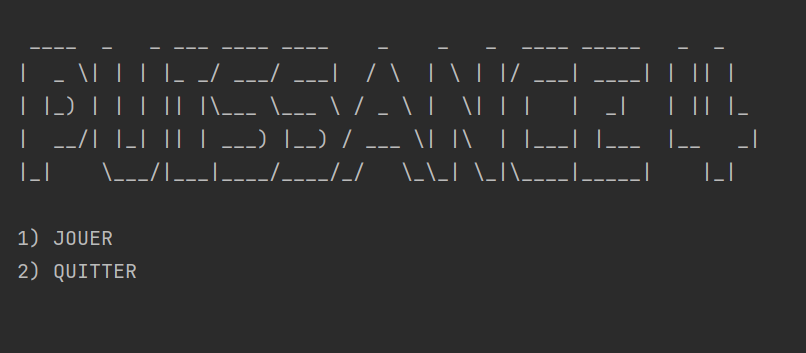
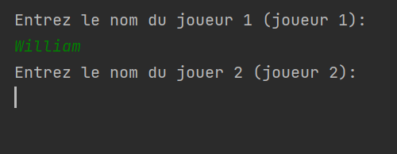
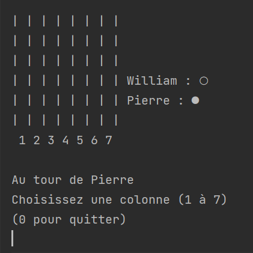
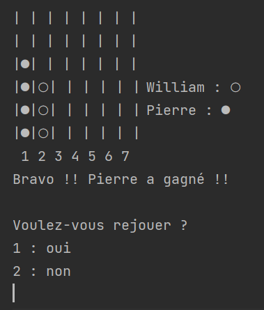

# <a id="puissance-4-en-ligne-de-commande"></a>PUISSANCE 4 (En ligne de commande)

- [PUISSANCE 4 (En ligne de commande)](#puissance-4-en-ligne-de-commande)
  - [Présentation du jeu](#présentation-du-jeu)
  - [Présentation technique](#presentation-technique)
  - [Notice d'utilisation](#notice-d'utilisation)
  - [Exemple d'utilisation](#exemple-d'utilisation)

## <a id="présentation-du-jeu"></a>Présentation du jeu

Le but du jeu est d'aligner une suite de 4 pions de même couleur sur une grille comptant 6 rangées et 7 colonnes. Chaque joueur dispose de 21 pions d'une couleur (par convention, en général jaune ou rouge). Tour à tour, les deux joueurs placent un pion dans la colonne de leur choix, le pion coulisse alors jusqu'à la position la plus basse possible dans la dite colonne à la suite de quoi c'est à l'adversaire de jouer. Le vainqueur est le joueur qui réalise le premier un alignement (horizontal, vertical ou diagonal) consécutif d'au moins quatre pions de sa couleur. Si, alors que toutes les cases de la grille de jeu sont remplies, aucun des deux joueurs n'a réalisé un tel alignement, la partie est déclarée nulle. 
>source : https://fr.wikipedia.org/wiki/Puissance_4


## <a id="presentation-technique"></a>Présentation technique

La fonction main est divisée en plusieurs parties:
* Affichage du menu principal (menu d'accueil)
* Initialisation des données du jeu (PLateau de jeu et noms de joueurs vides)
* Demande du nom des joueurs
* Démarrage de la boucle de jeu

La gestion du plateau de jeu est entièrement déléguée à la classe Plateau.
Cette classe contient un tableau à 2 dimensions contenant différentes valeurs en fonction des pions qui sont joués :
- 0 si la case est vide
- 1 si la case est occupée par un pion du joueur 1
- 2 si la case est occupée par un pion du joueur 2

A sa création, le constructeur initialise un tableau vide :

  ```java
  public Plateau() {
    plateau = new int[6][7];
    for(int i = 0; i < plateau.length; i++){
      for(int j = 0; j < plateau[0].length; j++) {
        plateau[i][j] = 0;
      }
    }
  }
  ```

Cette classe est aussi résponsable de diverse actions telle que :

1. Afficher le plateau au joueurs à l'aide de la méthode :
    ```java
    public void afficherPlateau(HashMap<Integer, String> nomJoueurs)
    ```
2. Vérifier si le plateau de jeu est plein :
    ```java
    public boolean plein()
    ```
3. Permettre à un joueur de jouer un pion dans une colonne :
    ```java
    public int ajouterPion(int joueur, int colonne)
    ```
    Le pion est ajouté après avoir déterminé quelle est la dernière ligne vide grâce à la méthode :
    ```java
    private int derniereLigneVide(int colonne)
    ```
    Une méthode est aussi disponible pour savoir si une colonne est pleine :
    ```java
    public boolean colonneJouable(int colonne)
    ```
4. Détecter un puissance 4 :
    ```java
    public boolean puissance4(int coordonneesLigne, int coordonneesColonne)
    ```
    Cette méthode nécessite les coordonnées du dernier pion ajouté dans le plateau.
    La méthode détecte l'alignement de 4 pions à partir de celui-ci.
    Cette détection s'effectue en 4 partie :
      - En ligne
      - En colonne
      - Dans les 2 diagonales
   
La classe GameMenus fournie une série de méthodes static pour afficher les menus aux joueurs
et gérer les entrées utilisateurs pour répondre aux questions

La classe GameData contient les variables globales nécessaires au fonctionnement du jeu détermine aléatoirement
quel joueur commence :
- Le plateau de jeu 
    ```java 
    static private Plateau plateau;
    ``` 
- Le numéro du joueur à qui c'est le tour de jouer
  ```java
  static private int joueurCourant;  

- La liste des joueurs
    ```java
    static private HashMap<Integer, String> joueurs = new HashMap<Integer, String>();
    ```
- L'initialisation d'une nouvelle partie
    ```java
    public static void initData(){
        plateau = new Plateau();
        joueurCourant = (int) Math.round(Math.random() + 1); //On determine aléatoirement quel joueur commence.
    }
    ```

## <a id="notice-d'utilisation"></a>Notice d'utilisation

Compilez le programme à l'aide de la commande suivante :
```
javac Main.java
```
Vous pouvez ensuite executer le programme avc la commande :
```
java Main
```

## <a id="exemple-d'utilisation"></a>Exemple d'utilisation



Entrez 1 puis pressez Entrée pour jouer.



Entrez le nom des joueurs puis pressez Entrée.



Entrez le numéro de la colonne dans laquelle vous voulez jouer, puis pressez Entrée.

Recommencez l'opération jusqu'à ce qu'un joueur gagne, ou que le plateau soit plein.



Entrez 1 si vous voulez rejouer, 0 pour quitter le programme. Puis pressez Entrée.
